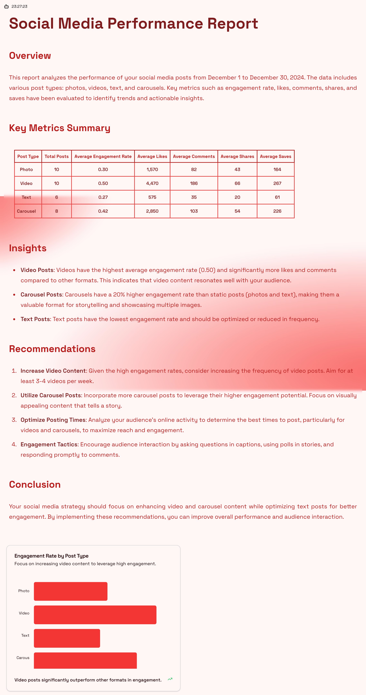
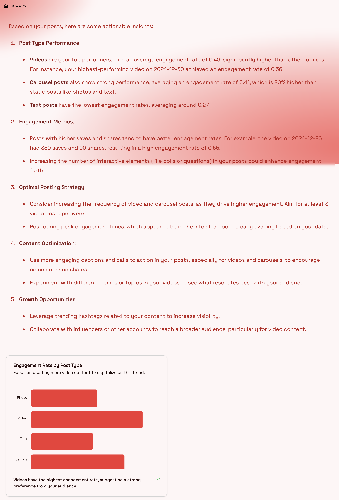
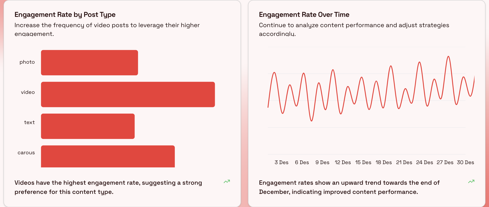
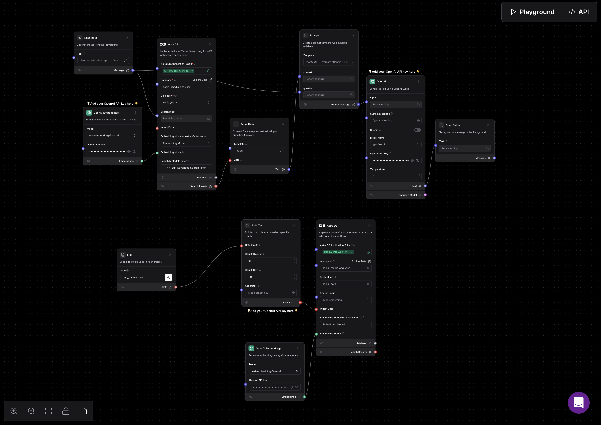

# Project Documentation: Social Pulse

## Table of Contents
1. [Introduction](#introduction)
2. [Features](#features)
3. [Data Specifications](#mock-dataset)
4. [Project Overview](#overview)
5. [Technologies Used](#technologies-used)
6. [Installation Guide](#installation-guide)
7. [System Architecture](#system-architecture)
8. [Workflow](#implementation-details)
9. [Challenges and Solutions](#challenges-and-solutions)
10. [Future Improvements](#future-improvements)

---

## Introduction
This project involves building a basic analytics module to analyze social media engagement data. The solution leverages **Langflow** for workflow creation and **DataStax Astra DB** for database operations, with GPT integration to generate actionable insights.


---
## Features
- List the core features with brief explanations:
  - Interactive Q&A with the bot
    
  - Data analysis
   
  - Actionable insights
  
  - Chart generation
  
  

---

### Mock Dataset
A dataset simulating social media posts and engagement metrics was created. Key features include:
- **Headers**: `post_id`, `post_type`, `upload_date`, `likes`, `shares`, `comments`, `saves`, `views`, `engagement_rate`.
- **Post Types**: Reels, carousels, static posts, stories.
- **Total Entries**: 100 posts sorted by upload date.
  
#### Example Data:
| post_id | post_type  | upload_date | likes | shares | comments | saves | views | engagement_rate |
|---------|------------|-------------|-------|--------|----------|-------|-------|-----------------|
| 1       | Reels      | 2025-01-01  | 1200  | 150    | 300      | 180   | 5000  | 0.45            |
| 2       | Carousels  | 2025-01-02  | 800   | 100    | 200      | 160   | 4000  | 0.35            |


---


## Overview
The project is structured into three core components:
1. **Data Storage**:
   - Engagement data is stored in **DataStax Astra DB**.
2. **Workflow Creation**:
   - Langflow workflows are used to process and query data.
3. **Insights Generation**:
   - GPT integration is utilized to create actionable insights.

---

## Technologies Used
- **Langflow**: For building workflows and integrating GPT.
- **DataStax Astra DB**: For efficient storage and querying of engagement data.
- **GPT (via Langflow)**: For generating natural language insights based on data.
- **Next.js**: For building the frontend and handling user interactions.

---

## Installation Guide


This is a [Next.js](https://nextjs.org) project bootstrapped with [`create-next-app`](https://nextjs.org/docs/app/api-reference/cli/create-next-app).

## Getting Started

1. Clone the repository.
2. Install dependencies:
   ```bash
   npm install
   ```
3. Set up environment variables.
4. Run the development server:

    ```bash
    npm run dev
    ```
5. Open [http://localhost:3000](http://localhost:3000) with your browser to see the result.

---

## System Architecture
- **LangFlowDiagram**:

  - 

- **Components**:
  - Frontend -> Next.js
  - Backend -> Langflow and Next.js API routes
  - Database -> DataStax Astra DB
  - APIs -> ChatGPT API (4o mini)

---


## Implementation Details
### Step 1: Fetch Engagement Data
1. **Dataset Preparation**:
   - Mock data was prepared using a CSV file.
   - Data was uploaded into **DataStax Astra DB**.
2. **Database Setup**:
   - Schema created with fields corresponding to post attributes (e.g., `post_id`, `post_type`, etc.).

### Step 2: Analyze Post Performance
1. **Langflow Workflow**:
   - Created a flow that accepts a **post type** as input.
   - Queries Astra DB to calculate average engagement metrics for the specified type.

### Step 3: Provide Insights
1. **GPT Integration**:
   - GPT generates natural language insights from the calculated metrics.
   - Example Insight: 
     - "Reels have an engagement rate 20% higher than carousels."
     - "Carousels outperform static posts in shares by 15%."


---

## APIs and Integrations
- List all APIs used with descriptions.
- Explain how integrations (e.g., vector databases, chart libraries) are handled.


---
## Submission Details
1. **Video Requirements**:
   - Walkthrough of:
     - Langflow workflow.
     - DataStax Astra DB setup and queries.
     - GPT insights generation.
   - Include the video link: [YouTube Video Link](#).
   
2. **Repository Details**:
   - Public repository: [GitHub Repo Link](#).

3. **Hackathon Submission**:
   - Submit on [FindCoder SuperMind Hackathon](https://www.findcoder.io/hackathons/SuperMind-Hackathon/67668c927a79c23209528177).

---

## Challenges and Solutions
### Challenges:
1. **Generate Json Data**:
   - Generating response in form of JSON.
2. **Generating Charts**:
   - Generating charts from aggregated data.

### Solutions:
- **JSON Generation**:
  - Utilized GPT to generate JSON response.
  - Enhanced GPT with additional context for better JSON generation.
- **Chart Generation**:
    - Utilized chart libraries to visualize aggregated data.
    - Enhanced GPT with additional context for better JSON generation.

---

## Future Improvements
- **Real-Time Data Integration**:
  - Connecting the module to live social media APIs for real-time analysis.
- **Advanced Metrics**:
  - Adding sentiment analysis for comments and audience demographics.
- **Customizable Insights**:
  - Allowing users to specify metrics of interest for tailored insights.
---
